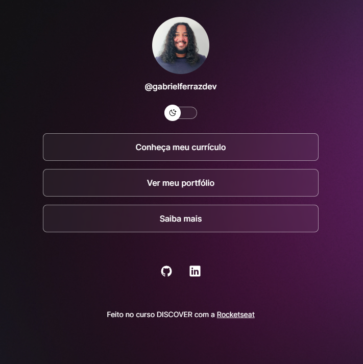

<strong><h1 align="center"> DevLinks </h1></strong>

  

O projeto DevLinks consiste em um menu animado, com modos escuro ou claro podendo ser alternados por meio de um botão "toggle".

---
## Tecnologias
O presente projeto foi criado utilizando as tecnologias: 
<ul>
<li>CSS </li>
<li>HTML </li>
<li>Javascript</li>
</ul>
